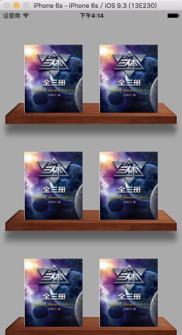
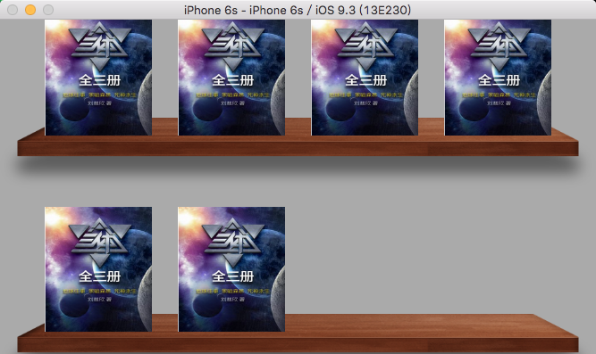
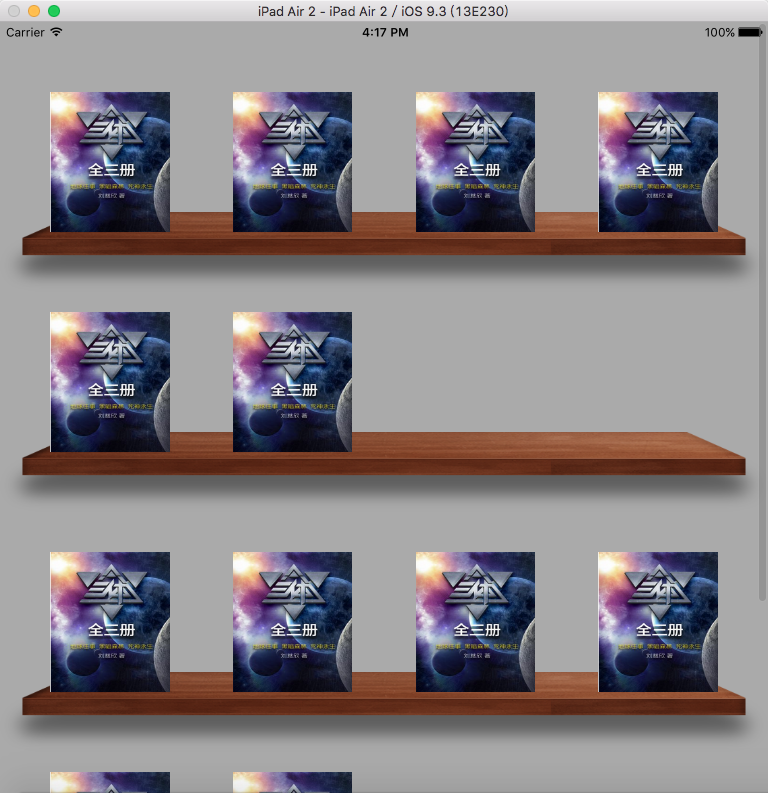
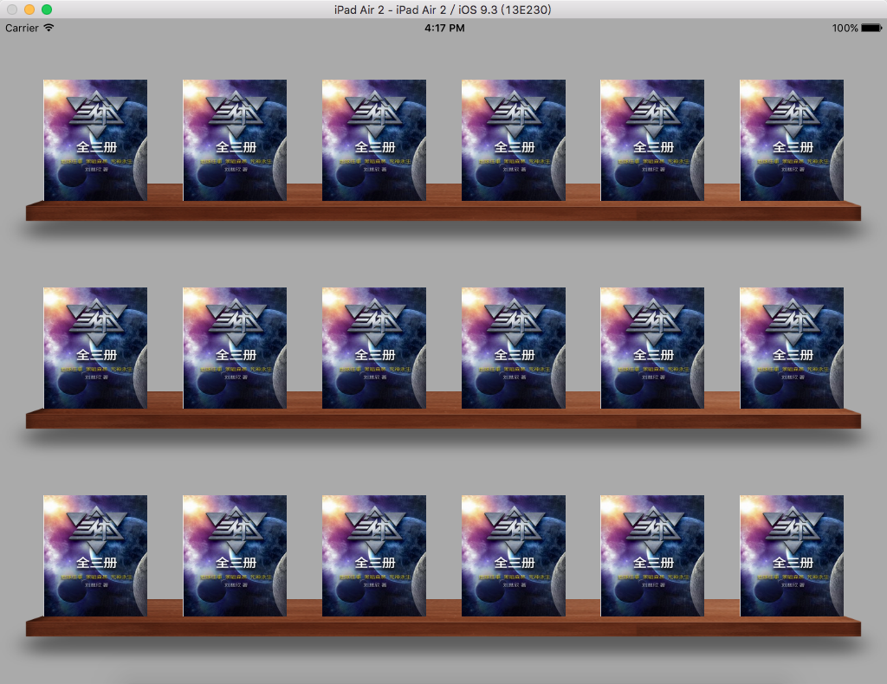

# BookShelfDemo
书架collectionView

# preview image

___

___

___

___
# Usage 用法
### 1 将ZXHDecorationView 文件夹拖入你的工程并参考下面步骤
### 2 新建的cllectionView必须继承自ZXHCollectionView
### 3 code
```
- (UICollectionViewCell *)collectionView:(UICollectionView *)collectionView cellForItemAtIndexPath:(NSIndexPath *)indexPath {
    UICollectionViewCell *cell = [collectionView dequeueReusableCellWithReuseIdentifier:reuseIdentifier forIndexPath:indexPath];
    
    // 依附每个cell 和indexPath 计算而实现的 decoration view
    // 没有用到复用，效率不高，但还行
    [ZXHDecorationView setDecorationViewForCollectionView:collectionView cell:cell indexPath:indexPath rightMargin:topMargin itemsForSection:itemsSection shelfImage:@"bookshelf"];
    
    return cell;
}
```
